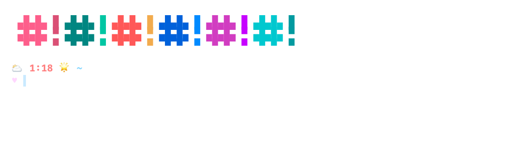
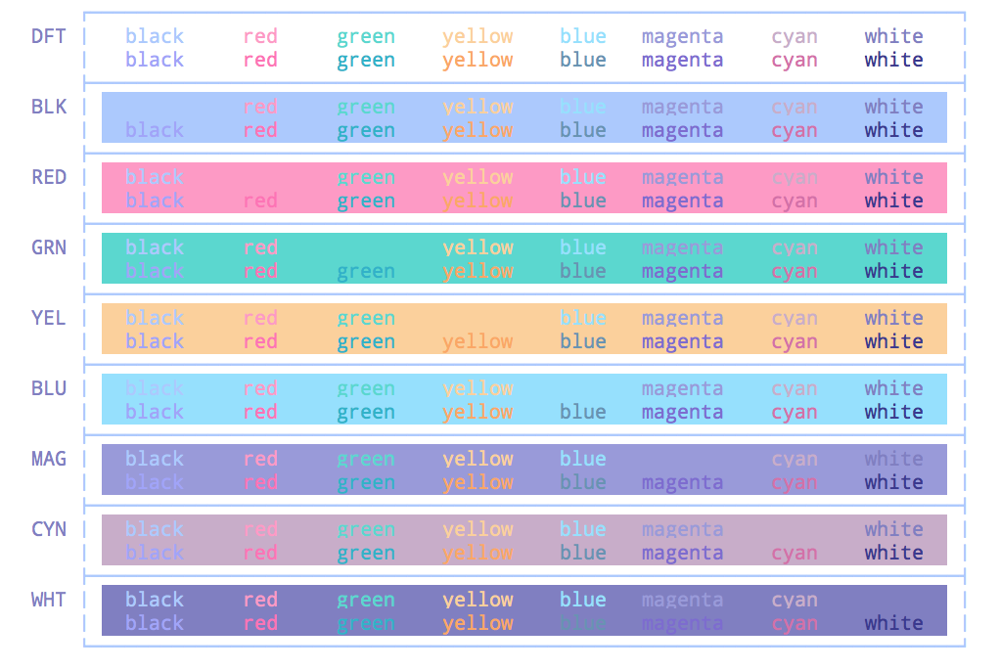
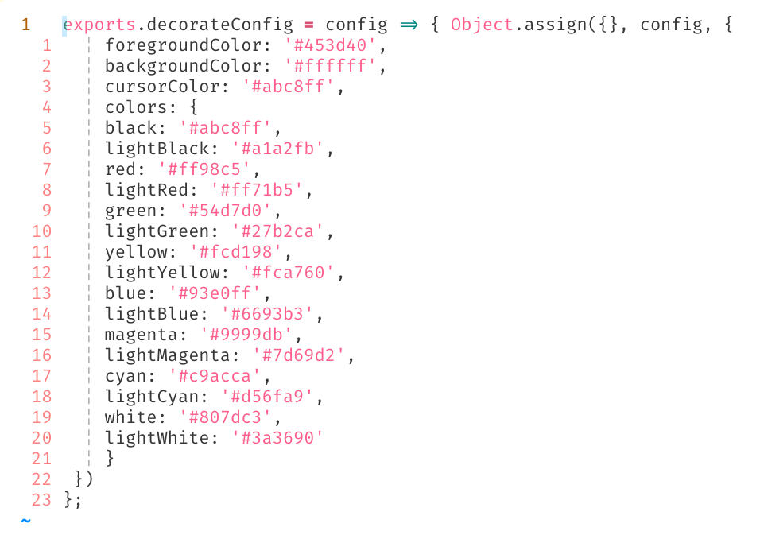

# hyper-mahoushoujo
A bright, energetic, light theme for [Hyper.app](https://hyper.is), inspired
by magical girls ✨





### installation
In your `.hyper.js`, add the package name to your plugins array:

```js
plugins: [
  'hyper-teatime',
]
```
